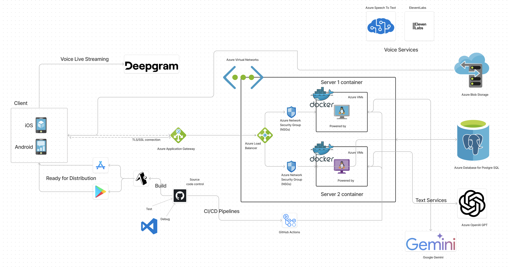

  
  
<a target="_blank" href="https://talktolisten.com">Talk To Listen</a>

Discover a new world of interaction with 'Talk To Listen' on your mobile phone – where your voice brings characters to life! Engage in seamless conversations with a diverse universe of characters, each boasting their own unique personality and voice. 

Check out [website](https://talktolisten.com) for download links and previews.

## Features
- **Voice-Activated Conversations**: Interact with characters using your voice, you don't have to type anything, or touch the screen, just talk and listen.
- **Diverse Characters**: Engage with a wide range of characters, each with their own unique personality and voice.
- **Group Conversations**: Talk with multiple characters at once.
- **Immersive Storytelling**: Dive into a world of storytelling and adventure.
- **Customizable Characters**: Personalize your characters with unique traits and characteristics.
- **Real-Time Interaction**: Experience real-time responses to your voice commands.
- **Cross-Platform Compatibility**: Access 'Talk To Listen' on any device, anytime, anywhere.

## Architecture

  

## Overview
The application's architecture is distributed, with several components interacting to provide the overall functionality. The front-end is built with Expo React Native, Redux, Firebase, and Axios, while the back-end uses FastAPI, SQLAlchemy, Firebase, Docker, and other technologies. The data is stored in a PostgreSQL database, and the application uses GitHub Actions, Docker, and Azure services for continuous integration and deployment. It also integrates with third-party APIs for features like voice live streaming and text to speech.

### 1. Infrastructure 
- Tech: Azure Virtual Machine, Azure Application Gateway, Azure Load Balancer, Azure Virtual Network, Azure Network Security Group.
- **Azure Application Gateway**: A web traffic load balancer that enables you to manage traffic to your web applications. (This is expensive, so it is likely to be removed in the future.)
- **Azure Load Balancer**: Distributes incoming network traffic across multiple virtual machines to ensure high availability and fault tolerance.
- **Azure Virtual Network**: Connects virtual machines to each other and to other Azure services securely. The virtual machined are only accessible through this internal load balancer.
- **Azure Network Security Group**: Provides network security by filtering inbound and outbound traffic to the virtual machines.

### Front-end
- Tech: Expo React Native (JavaScript), Redux, Firebase, Axios, Expo Update.
- [GitHub](https://github.com/Talktolisten/talktolisten-frontend)

#### Architecture
- **Expo React Native (JavaScript)**: A cross-platform framework for building mobile applications using JavaScript and React. It allows developers to write code once and deploy it on both iOS and Android platforms.
- **Expo Update**: Service that allows over-the-air updates for Talk To Listen. The app can be updated immediately without going through the app store. Any bugs or issues can be fixed quickly and efficiently.
- **Redux**: A state management library for JavaScript applications. It helps manage the application's state in a predictable way.
- **Firebase**: Provide secure authentication for users and store data in real-time.
- **Axios**: A promise-based HTTP client that makes it easy to send asynchronous HTTP requests to the backend server.

### 2. Back-end
- Tech: FastAPI(Python), SQLAlchemy, Firebase, Docker, Nginx, Gunicorn, Alembic, Pydantic, Pytest, RESTful APIs, Azure Virtual Machine.
- [GitHub](https://github.com/Talktolisten/talktolisten-backend)

#### Architecture
- **FastAPI( Python)**: Modern, fast (high-performance) Python framework for building APIs.
- **RESTful APIs**: The backend services expose RESTful APIs that the frontend can consume to interact with the application.
- **Azure Virtual Machines**: Multiple virtual machines are used to host the backend services. The virtual machines are duplicated to ensure high availability and fault tolerance. Talk To Listen uses Azure Virtual Machines to host the backend services, and always has more than one instance running to ensure that the application is always available.
- **SQLAlchemy**: A Python SQL toolkit and Object-Relational Mapping (ORM) library that provides a set of high-level APIs for working with databases.
- **Firebase**: Provides secure authentication with frontend and backend services. Only allowed users can access the application.
- **Docker**: The backend services are containerized using Docker to ensure consistency and portability across different environments.
- **PyTest**: All backend services are tested using PyTest to ensure that they work as expected.
- **SSL/TLS**: The backend services use SSL/TLS to encrypt data in transit and ensure secure communication between the frontend and backend.

### 3. Database
- Tech: PostgreSQL, Azure Database for PostgreSQL, Azure Blob Storage

#### Architecture
- **PostgreSQL**: Talk To Listen uses PostgreSQL as the primary database to store user data, character information, and other application data.
- **Azure Database for PostgreSQL**: A fully managed database service that provides high availability, scalability, and security for PostgreSQL databases.
- **Azure Blob Storage**: Used to store large amounts of unstructured data, such as images, audio files, and other media files.

#### Design
- The database schema is designed to store user data, character information, and other application data in a structured and efficient manner.
- **Entity-Relationship Diagram**: The database schema is designed using an Entity-Relationship Diagram (ERD) to visualize the relationships between different entities and attributes.
  

  

- **UML Diagram**: The database schema is designed using a Unified Modeling Language (UML) diagram to visualize the classes, attributes, and relationships between different entities.

  

### 4. Continuous Integration/Continuous Deployment
- Tech: Git/GitHub, GitHub Actions, Docker, Azure Virtual Machine

#### Architecture
- **Git/GitHub**: The source code is stored in GitHub repositories for version control and collaboration.
- **GitHub Actions**: Used for continuous integration and continuous deployment (CI/CD) to automate the build, test, and deployment processes for the backend services.
- **Docker**: The backend services are containerized using Docker to ensure consistency and portability across different environments.
- **Azure Virtual Machine**: The backend services are deployed on Azure Virtual Machines using Docker containers.

### 5. Talk To Listen LLM
- Other from GPT, and Google Gemini, some characters are generated by Talk To Listen LLM.
- Talk To Listen LLM is fine-tuned on the Talk To Listen dataset. The model is based on the Zephyr-7B and is optimized for generating human-like responses in a conversational setting and can adapt to different characters' personalities.
- Model fine-tuning: [GitHub Repository](https://github.com/Talktolisten/talktolisten-ttl-LLM-dev)
- Model deployment: [GitHub Repository](https://github.com/Talktolisten/talktolisten-LLM-prod)

### 6. Third-party APIs
- Voice Live Streaming: [Deepgram](https://www.deepgram.com/)
- Text To Speech: [EleventLabs](https://elevenlabs.io), [Azure Text To Speech](https://azure.microsoft.com/en-us/products/ai-services/ai-speech)

## Developer
- Hieu "Leo" Nguyen. 
- [Website](https://www.mywebleo.com) and [GitHub](https://github.com/hieuminh65)
- The code is only for showcasing purposes and under the Apache 2.0 License.
